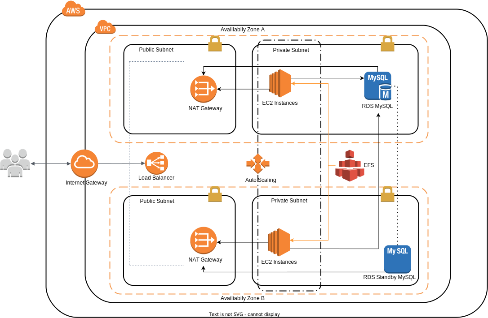

Creation of the AWS infrastructure for hosting wordpress websites

## Diagram


## Requirements

| Name | Version |
|------|---------|
| <a name="requirement_terraform"></a> [terraform](#requirement\_terraform) | >= 1.2.0 |
| <a name="requirement_aws"></a> [aws](#requirement\_aws) | ~> 4.16 |
| <a name="requirement_aws_cli"></a> [aws cli](#requirement\_aws_cli) | >= 1.22.34 |

## Providers

| Name | Version |
|------|---------|
| <a name="provider_aws"></a> [aws](#provider\_aws) | 4.30.0 |

## Outputs

| Name | Description |
|------|-------------|
| <a name="output_elb_dns_name"></a> [elb\_dns\_name](#output\_elb\_dns\_name) | n/a |
| <a name="output_rds_endpoint"></a> [rds\_endpoint](#output\_rds\_endpoint) | n/a |

## Usage

### Criação de usuário do IAM

Create an IAM user to run Terraform in the AWS Management Console.
- Purchase **IAM** from **Services** in the AWS Management Console.
- Click on **Add User** under **Users** under **Access Management**.
- Type **terraform** for Username, check **Programmatic Access** for Access Type and click **Next Step: Permissions**.
- Click **Append existing policy directly**, check **AdministratorAccess** and click **Next step: tags**.
- Click on **Next Step: Confirm** without adding tags.
- Confirm the content and click on **Create User**.
- The Passkey ID and Secret Passkey will be displayed, so write them down, click **Download csv** and click **Close**.

### Install AWS CLI

Set the configuration file and authentication information file.

```
$ aws configure
AWS Access Key ID [None]: {access key}
AWS Secret Access Key [None]: {secret access key}
Default region name [None]: us-east-1
Default output format [None]: json
```
### Terraform resource creation

```
git clone https://github.com/nemuelsousa/iac_terraform_wordpress.git
```

### Create key pair for EC2

In the directory where the Terraform source code is.

```
$ ssh-keygen -t rsa -f ec2_key -N ''
```

### Infrastructure provisioning

```
$ terraform init
```
```
$ terraform fmt
```
```
$ terraform validate
```
```
$ terraform plan
```
```
$ terraform apply
```
```
$ terraform destroy
```
### Description of commands:

terraform init: Run terraform init to download all necessary plugins.
terraform fmt: The command is used to rewrite Terraform configuration files to a canonical format and style.
terraform validate: Command syntactically validates configuration files in a directory.
terraform plan: Execute a terraform plan and place it in a file called plan.
terraform apply: Use plan to apply changes in Cloud.
terraform destroy: Deletes all created resources in Cloud.